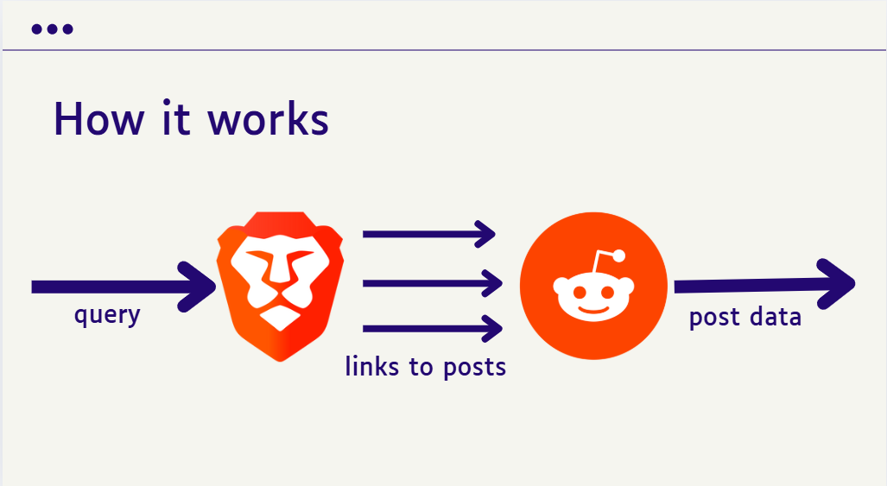

<!-- Improved compatibility of back to top link: See: https://github.com/othneildrew/Best-README-Template/pull/73 -->
<a id="readme-top"></a>

# r/askAgent

Author: Manas Ranjan

<!-- ABOUT THE PROJECT -->
With the rise of AI-generated content, finding trustworthy information has become increasingly challenging. Many users now rely on Reddit as a source of authentic human insights. This agent simplifies your research by identifying relevant Reddit posts and extracting key insights from both posts and comments. It provides an easy way to integrate Reddit results into your agents and can be combined with other APIs like YouTube or Twitter to automate consumer research.


## What can this agent do?

* Discover the best restaurants in Chicago
* Find top sci-fi movies
* Explore alternatives to Google Slides
* Get recommendations for dark academia books
* Compare housing in San Francisco vs. New York City
* Identify emerging indie artists
* Learn about the best AI tools for front-end development

<p align="right">(<a href="#readme-top">back to top</a>)</p>

## Custom UI for Tool Calls

View arguments and results from tool calls, along with custom cards for each post fetched by the `search_reddit` tool.


* Note: The `ui` folder contains reusable React components, not a standalone app.

## How it works

The search process is handled by the `search_reddit` function in the `ai_agent.py` file. It takes a query, searches the web, parses the top links (if they are Reddit posts), and extracts data from the posts and their top comments.



*Note: While Reddit's API or PRAW can be used for searches, they often yield inconsistent results, including irrelevant posts. Using the Brave Search API offers a more reliable approach, allowing you to append terms like "YouTube" to queries and retrieve URLs without requiring additional API credentials.*

## How is this better than Reddit Answers (currently in beta)?

* Can be combined with other agents to generate reports or complete tasks
* Includes upvote counts to gauge comment authority
* Maintains chat history for easy access to past conversations
* Not restricted to the US

## Tech Stack

### APIs/Integrations
* [Brave Search API](https://brave.com/search/api/)
* [Reddit](https://www.reddit.com/dev/api/) 
* [OpenAI](https://platform.openai.com/docs/overview)

### Libraries Used

* [Pydantic AI](https://github.com/pydantic/pydantic-ai) - For creating AI agents with tools
* [Async PRAW](https://asyncpraw.readthedocs.io/en/stable/index.html) - For interacting with Reddit's API
* FastAPI - For quickly setting up and hosting an API

<p align="right">(<a href="#readme-top">back to top</a>)</p>

## Getting Started

This project does not include a complete frontend. For a full Streamlit interface, check out [this repo](https://github.com/kai-feinberg/reddit-agent).

To modify or add tools to the AI agent, edit `ai_agent.py`. If you add new dependencies, ensure they are included in the context within the endpoint file. For a detailed guide, watch this video: [https://youtu.be/zf_D2Eafvk0?si=Uv0pxXXdEVjDvC6K](https://youtu.be/zf_D2Eafvk0?si=Uv0pxXXdEVjDvC6K).

### Installation

Follow these steps to set up the project:

1. Obtain API keys for Brave and Reddit (see `.env.example` for instructions).
2. Rename `.env.example` to `.env` and add your keys, including the OpenAI API key.
3. Install the required dependencies (using a virtual environment like `venv` is recommended):
  ```sh
  pip install -r requirements.txt
  ```
4. Run the endpoint:
  ```sh
  python ./agent_endpoint.py
  ```
5. Use Agent 0 to interact with your agent. Follow this guide to set it up: [https://www.youtube.com/watch?v=7XZbI_ez8_U](https://www.youtube.com/watch?v=7XZbI_ez8_U).

<p align="right">(<a href="#readme-top">back to top</a>)</p>

## Custom UI (for a React Frontend)

When a response is generated, it stores a message with the following schema:

```json
{
  "type": "ai",
  "content": "Agent's response text",
  "data": {
   "...additional info for the frontend..."
  }
}
```

The endpoint stores tool usage data in the `data` field with this schema. `args` contains the tool's input arguments, and `result` contains the returned data. Each tool call is uniquely identified.

```json
  "tool_results": {
    "TOOL_CALL_IDENTIFIER": {
      "args": {
        "TOOL_ARGUMENTS": "DATA"
      },
      "result": {
        "TOOL_DATA": "DATA"
      },
      "tool_name": "MY_TOOL"
    },
    call___XXXXX {..}
  }
```

<details>
  <summary>CLICK FOR EXAMPLE DATA</summary>

  ```json
  "tool_results": {
    "call_0tNO9fe3yKtsWQnM5jq406xr": {
      "args": {
       "query": "minecraft"
      },
      "result": {
       "subreddits": ["Minecraft", "MinecraftMemes", "MinecraftBuddies", "Minecraftbuilds", "teenagers"]
      },
      "tool_name": "find_subreddits"
    },
    "call_1xYZ9ab3cDtsWQnM5jq406yz": {
      "args": {
       "city": "New York",
       "date": "2023-05-15"
      },
      "result": {
       "temperature": 72,
       "conditions": "Partly cloudy",
       "humidity": 65
      },
      "tool_name": "get_weather"
    }
  }
  ```

</details>

The `/ui` folder contains two React components that utilize this tool data:

1. `tool_results.tsx`: Displays tools used, their arguments, and returned content.
2. `reddit_result.tsx`: Renders cards for Reddit posts fetched using the `search_reddit` tool.


